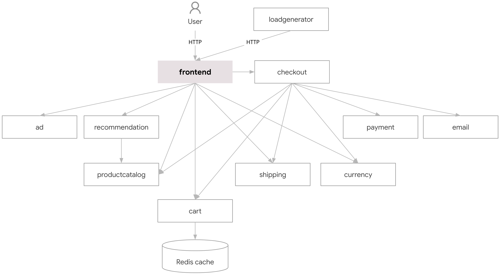
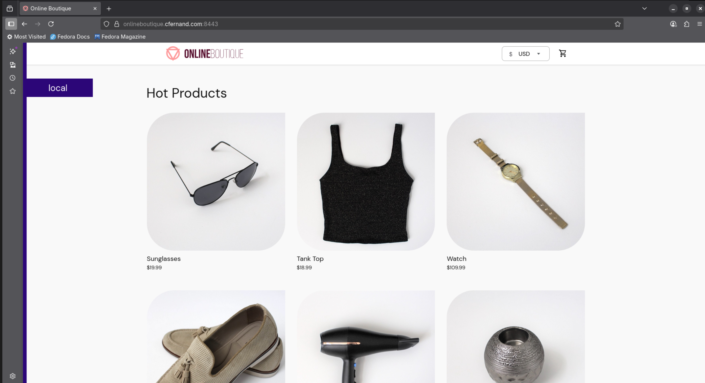
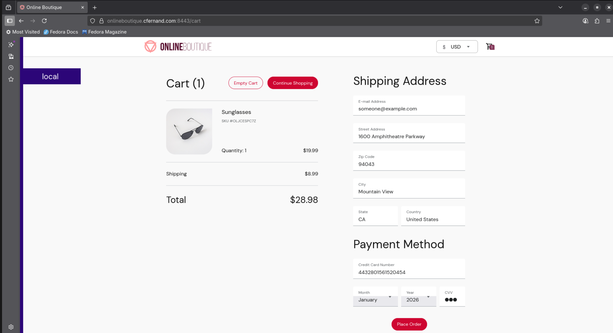
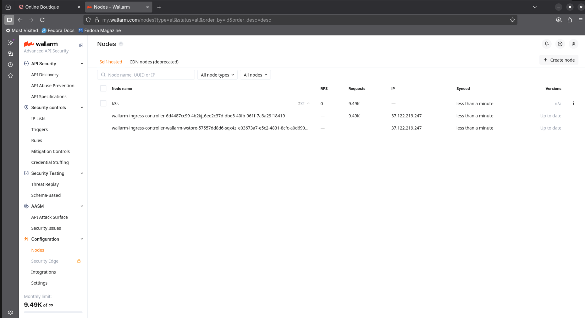
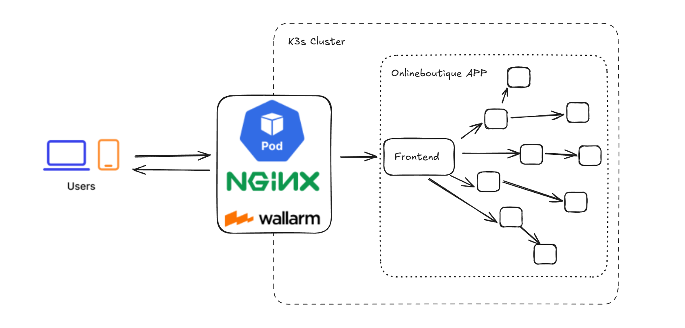
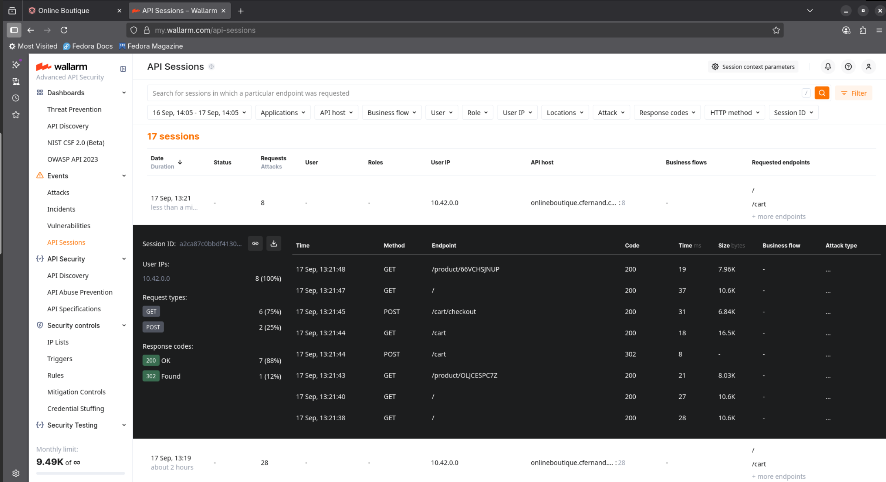
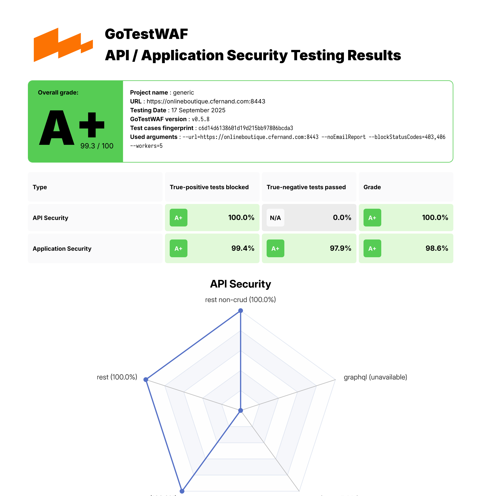
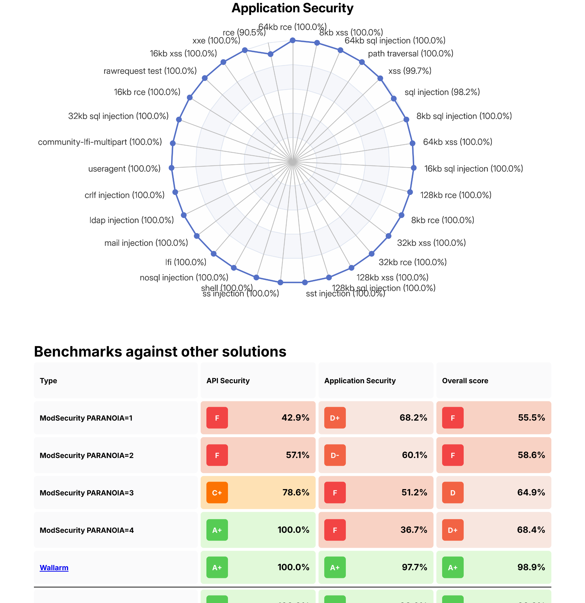
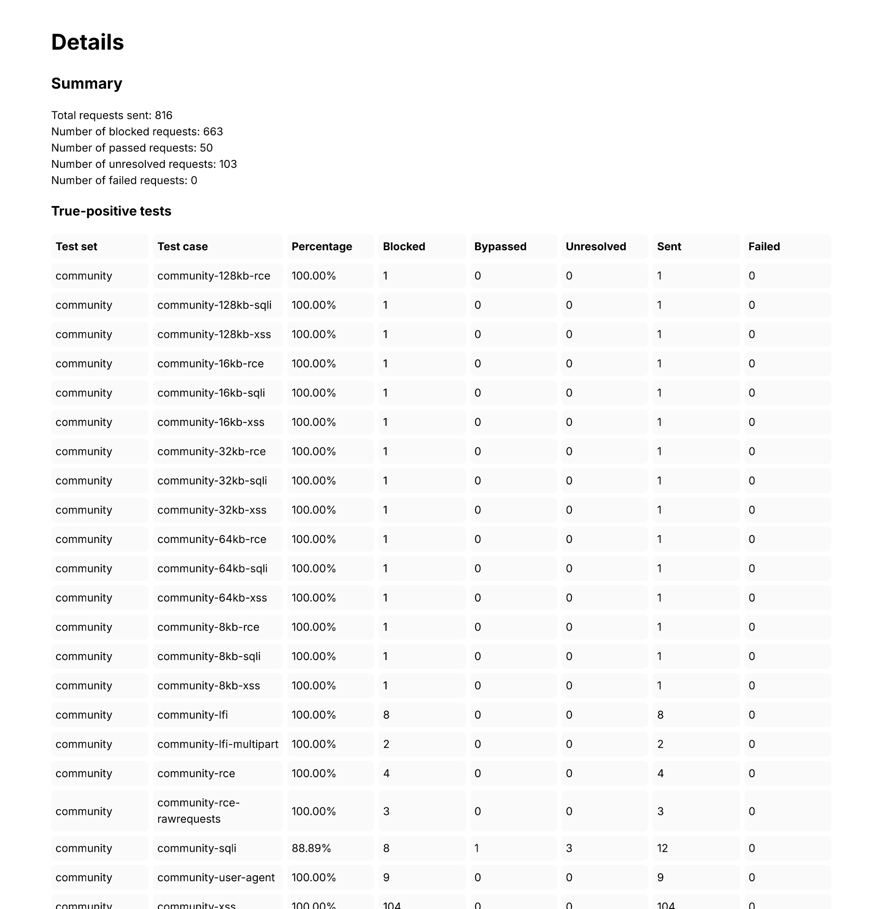
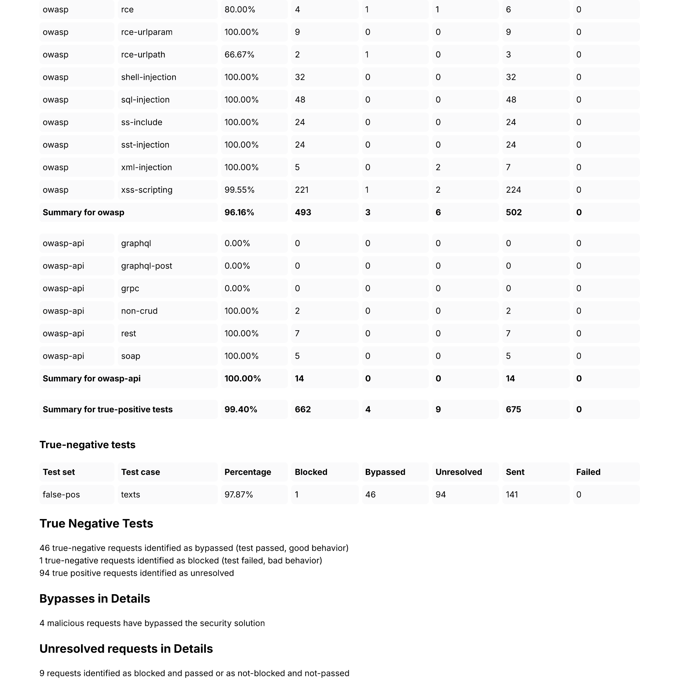

# Wallarm Solutions Engineer Technical Evaluation - Cesar Fernandez

## Challenge: Deploy Online Boutique with Wallarm WAF and Test with GoTestWAF

This challenge demonstrates how to deploy the [Google Online Boutique](https://github.com/GoogleCloudPlatform/microservices-demo) demo application on a **K3s Kubernetes cluster**, protect it with **Wallarm WAF**, and validate the protection using **GoTestWAF**.

---
* [Prerequisites](#prerequisites)
* [Deploy Online Boutique Application](#deploy-onlineboutique-app)
* [Deploy Wallarm Ingress Controller](#deploy-wallarm-ingress)
* [Expose Online Boutique Through Wallarm](#expose-onlineboutique-wallarm)
* [Change Wallarm Filtering Mode](#change-wallarm-filtering)
* [Run GoTestWAF](#run-gotestwaf)
* [Running with OWASP Core Rule Set regression testing suite](#running-with-owasp-core-rule-set-regression-testing-suite)
---


## 1. Prerequisites

- A running **K3s** (or Kubernetes) cluster with:
  - 1 server node
  - 1+ agent nodes
- Helm v3 installed
- Podman or Docker installed on your workstation
- A DNS domain pointing to your cluster nodes (`onlineboutique.cfernand.com` in this guide)

---

## 2. Deploy Online Boutique Application

Clone the repository and deploy into a dedicated namespace:

```bash
# git clone https://github.com/GoogleCloudPlatform/microservices-demo.git
# cd microservices-demo

# kubectl create namespace onlineboutique
# kubectl apply -n onlineboutique -f ./release/kubernetes-manifests.yaml
```

Verfy pods:

```bash
# kubectl get pods -n onlineboutique
NAME                                     READY   STATUS    RESTARTS        AGE
adservice-54fdcb4646-tkvcq               1/1     Running   0               3h14m
cartservice-7fc8f4c7f6-5wpg5             1/1     Running   0               3h14m
checkoutservice-5d9d84cd44-mgjqc         1/1     Running   0               3h14m
currencyservice-598d5f8fc9-zzjjq         1/1     Running   0               3h14m
emailservice-7d4b8cd7d6-xtqnl            1/1     Running   1 (3h13m ago)   3h14m
frontend-54b88b654f-fwddw                1/1     Running   0               3h14m
loadgenerator-5bcc6f6bdb-fjh74           1/1     Running   0               3h14m
paymentservice-68ff6d5f7c-kmbfh          1/1     Running   0               3h14m
productcatalogservice-5f4f7969b4-6lvbl   1/1     Running   0               3h14m
recommendationservice-5966b9f59d-tfc2h   1/1     Running   0               3h14m
redis-cart-cc795856-5r2zq                1/1     Running   0               3h14m
shippingservice-5565748dc4-8ss5g         1/1     Running   0               3h14m

```

Online Boutique is composed of 11 microservices written in different languages that talk to each other over gRPC.



### Screenshots






## 3. Deploy Wallarm Ingress Controller

To install the [Wallarm Ingress Controller](https://docs.wallarm.com/admin-en/installation-kubernetes-en/#step-1-installing-the-wallarm-ingress-controller):

1. Create an API token from the Wallarm Console:

    - Open Wallarm Console → Settings → API tokens in the US Cloud or EU Cloud.
    - Find or create API token with the Node deployment/Deployment usage type.
    - Copy this token.

2. Create a Kubernetes namespace to deploy the Helm chart with the Wallarm Ingress controller:

```bash
# kubectl create namespace ingress-wallarm
```

3. Add the [Wallarm chart repository](https://charts.wallarm.com/):

```bash
# helm repo add wallarm https://charts.wallarm.com
# helm repo update wallarm
```

4. Create the values.yaml file with the [Wallarm configuration](https://docs.wallarm.com/admin-en/configure-kubernetes-en). Example of the file with the minimum configuration is below.

```yaml
---
controller:
  wallarm:
    enabled: "true"
    token: "<YOUR_WALLARM_API_TOKEN>"

```

5. Install the Wallarm packages:

```bash
# helm install --version 6.5.1 wallarm-ingress wallarm/wallarm-ingress -n ingress-wallarm -f k3s/wallarm/values.yaml --set controller.ingressClassResource.name=wallarm --set controller.ingressClassByName=true --set controller.ingressClassResource.controllerValue="k8s.io/ingress-nginx"
```

Check Wallarm pods status:

```bash
# kube get pods -n ingress-wallarm
NAME                                                         READY   STATUS    RESTARTS   AGE
wallarm-ingress-controller-6d4487cc99-4b2kj                  3/3     Running   0          2d
wallarm-ingress-controller-wallarm-wstore-57557dd8d6-sqx4z   3/3     Running   0          2d
```

Additionaly, we can check if the Wallarm filter node is regitered correctly from the Wallarm Console:

    - Open Wallarm Console → Configuration → Nodes.



## 4. Expose Online Boutique Through Wallarm

1. In my case, since I already had the Nginx Ingress Controller running on my K3s cluster, I had to patch the Wallarm Service (the wallarm-ingress-controller one) to listen on different ports, 8080 and 8443.

```yaml
apiVersion: v1
kind: Service
metadata:
  labels:
    app.kubernetes.io/component: controller
    app.kubernetes.io/instance: wallarm-ingress
    app.kubernetes.io/managed-by: Helm
    app.kubernetes.io/name: wallarm-ingress
    app.kubernetes.io/part-of: wallarm-ingress
    app.kubernetes.io/version: 6.5.1
    helm.sh/chart: wallarm-ingress-6.5.1
  name: wallarm-ingress-controller
  namespace: ingress-wallarm
spec:
  allocateLoadBalancerNodePorts: true
  clusterIP: 10.43.20.93
  clusterIPs:
  - 10.43.20.93
  externalTrafficPolicy: Cluster
  internalTrafficPolicy: Cluster
  ipFamilies:
  - IPv4
  ipFamilyPolicy: SingleStack
  ports:
  - appProtocol: http
    name: http
    nodePort: 32277
    port: 8080
    protocol: TCP
    targetPort: http
  - appProtocol: https
    name: https
    nodePort: 32263
    port: 8443
    protocol: TCP
    targetPort: https
  selector:
    app.kubernetes.io/component: controller
    app.kubernetes.io/instance: wallarm-ingress
    app.kubernetes.io/name: wallarm-ingress
  sessionAffinity: None
  type: LoadBalancer
```

```bash
# kube get services wallarm-ingress-controller -n ingress-wallarm 
NAME                         TYPE           CLUSTER-IP    EXTERNAL-IP                   PORT(S)                         AGE
wallarm-ingress-controller   LoadBalancer   10.43.20.93   192.168.30.10,192.168.30.11   8080:32277/TCP,8443:32263/TCP   2d
```

```bash
# kubectl get ingressclass
NAME      CONTROLLER             PARAMETERS   AGE
nginx     k8s.io/ingress-nginx   <none>       36d
wallarm   k8s.io/ingress-nginx   <none>       2d
```

2. Create an ingress resource for the frontend service:

```yaml
---
apiVersion: networking.k8s.io/v1
kind: Ingress
metadata:
  name: onlineboutique
  namespace: onlineboutique
  annotations:
    nginx.ingress.kubernetes.io/backend-protocol: "HTTPS"
    nginx.ingress.kubernetes.io/ssl-redirect: "true"
spec:
  ingressClassName: wallarm
  rules:
  - host: onlineboutique.cfernand.com
    http:
      paths:
      - path: /
        pathType: Prefix
        backend:
          service:
            name: frontend
            port:
              number: 80
  tls:
  - hosts:
    - onlineboutique.cfernand.com
    secretName: onlineboutique-tls
```

Note: The frontend service exposes an HTTP server to serve the website. Does not require signup/login and generates session IDs for all users automatically.

Apply it:

```bash
# kubectl apply -f onlineboutique-ingress.yaml
```
Ckeck it:

```bash
# kube get ingress onlineboutique -n onlineboutique
NAME             CLASS     HOSTS                         ADDRESS                       PORTS     AGE
onlineboutique   wallarm   onlineboutique.cfernand.com   192.168.30.10,192.168.30.11   80, 443   4h2m
```

Confirm connectivity:

```bash
# curl -vk https://onlineboutique.cfernand.com:8443/
```

Wallarm Architecture:



3. Enabling traffic analysis for your Ingress:

```bash
# kubectl annotate ingress onlineboutique -n onlineboutique nginx.ingress.kubernetes.io/wallarm-mode=monitoring
```

4. Check API Sessions on the Wallarm Console:

- Open Wallarm Console → Events → API Sessions, to see all the API sessions.



## 5. Change Wallarm Filtering Mode

Filtration mode defines the filtering node behavior when processing incoming requests. These instructions describe available filtration modes and their configuration methods.

Wallarm supports:

- Monitoring – logs but does not block (the one we have enabled on the previous step).

- Safe blocking – blocks confirmed attacks.

- Blocking – blocks all detected attacks.

The filtration mode can be configured in the following ways:

- Set the wallarm_mode directive on the node side

- Define the general filtration mode in Wallarm Console

- Define the conditioned filtration mode settings in Wallarm Console

Since I used the NGINX-based Ingress controller, I change the filtering mode in the Ingress I configured for my onlineboutique application by changing the annotation `nginx.ingress.kubernetes.io/wallarm-mode` to `block`.

```yaml
---
apiVersion: networking.k8s.io/v1
kind: Ingress
metadata:
  name: onlineboutique
  namespace: onlineboutique
  annotations:
    nginx.ingress.kubernetes.io/backend-protocol: "HTTPS"
    nginx.ingress.kubernetes.io/ssl-redirect: "true"
    nginx.ingress.kubernetes.io/wallarm-mode: block
spec:
  ingressClassName: wallarm
  rules:
  - host: onlineboutique.cfernand.com
    http:
      paths:
      - path: /
        pathType: Prefix
        backend:
          service:
            name: frontend
            port:
              number: 80
  tls:
  - hosts:
    - onlineboutique.cfernand.com
    secretName: onlineboutique-tls
```

## 6. Run GoTestWAF

[GoTestWAF](https://github.com/wallarm/gotestwaf) is a tool for API and OWASP attack simulation that supports a wide range of API protocols including REST, GraphQL, gRPC, SOAP, XMLRPC, and others.

It was designed to evaluate web application security solutions, such as API security proxies, Web Application Firewalls, IPS, API gateways, and others.

1. Prepare GoTestWAF reports directory

```bash
# docker volume create gotestwaf
```

2. Run GoTestWAF

```bash
# docker run --rm --network=host -v gotestwaf:/app/reports wallarm/gotestwaf:latest --url "https://onlineboutique.cfernand.com:8443" --noEmailReport
```

Check the evaluation results logged using the `STDOUT` and `STDERR` services. For example:

```
time="2025-09-17T10:49:51Z" level=info msg="GoTestWAF started" version=v0.5.8
time="2025-09-17T10:49:51Z" level=info msg="Test cases loading started"
time="2025-09-17T10:49:51Z" level=info msg="Test cases loading finished"
time="2025-09-17T10:49:51Z" level=info msg="Test cases fingerprint" fp=c6d14d6138601d19d215bb97806bcda3
time="2025-09-17T10:49:51Z" level=info msg="Try to identify WAF solution"
time="2025-09-17T10:49:51Z" level=info msg="WAF was not identified"
time="2025-09-17T10:49:51Z" level=info msg="gohttp is used as an HTTP client to make requests" http_client=gohttp
time="2025-09-17T10:49:51Z" level=info msg="WAF pre-check" url="https://onlineboutique.cfernand.com:8443"
time="2025-09-17T10:49:51Z" level=info msg="WAF pre-check" blocked=true code=403 status=done
time="2025-09-17T10:49:51Z" level=info msg="gRPC pre-check" status=started
time="2025-09-17T10:49:51Z" level=info msg="gRPC pre-check" connection="not available" status=done
time="2025-09-17T10:49:51Z" level=info msg="GraphQL pre-check" status=started
time="2025-09-17T10:49:51Z" level=info msg="GraphQL pre-check" connection="not available" status=done
time="2025-09-17T10:49:51Z" level=info msg="Scanning started" url="https://onlineboutique.cfernand.com:8443"
time="2025-09-17T10:51:34Z" level=info msg="Scanning finished" duration=1m42.786456106s
True-Positive Tests:
┌────────────┬───────────────────────────┬──────────────────────┬─────────────────────┬──────────────────────┬────────────────────┬─────────────┬─────────────────┐
│  TEST SET  │         TEST CASE         │    PERCENTAGE , %    │       BLOCKED       │       BYPASSED       │     UNRESOLVED     │    SENT     │     FAILED      │
├────────────┼───────────────────────────┼──────────────────────┼─────────────────────┼──────────────────────┼────────────────────┼─────────────┼─────────────────┤
│ community  │ community-128kb-rce       │ 100.00               │ 1                   │ 0                    │ 0                  │ 1           │ 0               │
│ community  │ community-128kb-sqli      │ 100.00               │ 1                   │ 0                    │ 0                  │ 1           │ 0               │
│ community  │ community-128kb-xss       │ 100.00               │ 1                   │ 0                    │ 0                  │ 1           │ 0               │
│ community  │ community-16kb-rce        │ 100.00               │ 1                   │ 0                    │ 0                  │ 1           │ 0               │
│ community  │ community-16kb-sqli       │ 100.00               │ 1                   │ 0                    │ 0                  │ 1           │ 0               │
│ community  │ community-16kb-xss        │ 100.00               │ 1                   │ 0                    │ 0                  │ 1           │ 0               │
│ community  │ community-32kb-rce        │ 100.00               │ 1                   │ 0                    │ 0                  │ 1           │ 0               │
│ community  │ community-32kb-sqli       │ 100.00               │ 1                   │ 0                    │ 0                  │ 1           │ 0               │
│ community  │ community-32kb-xss        │ 100.00               │ 1                   │ 0                    │ 0                  │ 1           │ 0               │
│ community  │ community-64kb-rce        │ 100.00               │ 1                   │ 0                    │ 0                  │ 1           │ 0               │
│ community  │ community-64kb-sqli       │ 100.00               │ 1                   │ 0                    │ 0                  │ 1           │ 0               │
│ community  │ community-64kb-xss        │ 100.00               │ 1                   │ 0                    │ 0                  │ 1           │ 0               │
│ community  │ community-8kb-rce         │ 100.00               │ 1                   │ 0                    │ 0                  │ 1           │ 0               │
│ community  │ community-8kb-sqli        │ 100.00               │ 1                   │ 0                    │ 0                  │ 1           │ 0               │
│ community  │ community-8kb-xss         │ 100.00               │ 1                   │ 0                    │ 0                  │ 1           │ 0               │
│ community  │ community-lfi             │ 100.00               │ 8                   │ 0                    │ 0                  │ 8           │ 0               │
│ community  │ community-lfi-multipart   │ 100.00               │ 2                   │ 0                    │ 0                  │ 2           │ 0               │
│ community  │ community-rce             │ 100.00               │ 4                   │ 0                    │ 0                  │ 4           │ 0               │
│ community  │ community-rce-rawrequests │ 100.00               │ 3                   │ 0                    │ 0                  │ 3           │ 0               │
│ community  │ community-sqli            │ 88.89                │ 8                   │ 1                    │ 3                  │ 12          │ 0               │
│ community  │ community-user-agent      │ 100.00               │ 9                   │ 0                    │ 0                  │ 9           │ 0               │
│ community  │ community-xss             │ 100.00               │ 104                 │ 0                    │ 0                  │ 104         │ 0               │
│ community  │ community-xxe             │ 100.00               │ 2                   │ 0                    │ 0                  │ 2           │ 0               │
│ owasp      │ crlf                      │ 100.00               │ 7                   │ 0                    │ 0                  │ 7           │ 0               │
│ owasp      │ ldap-injection            │ 100.00               │ 23                  │ 0                    │ 1                  │ 24          │ 0               │
│ owasp      │ mail-injection            │ 100.00               │ 24                  │ 0                    │ 0                  │ 24          │ 0               │
│ owasp      │ nosql-injection           │ 100.00               │ 50                  │ 0                    │ 0                  │ 50          │ 0               │
│ owasp      │ path-traversal            │ 100.00               │ 20                  │ 0                    │ 0                  │ 20          │ 0               │
│ owasp      │ rce                       │ 80.00                │ 4                   │ 1                    │ 1                  │ 6           │ 0               │
│ owasp      │ rce-urlparam              │ 100.00               │ 9                   │ 0                    │ 0                  │ 9           │ 0               │
│ owasp      │ rce-urlpath               │ 66.67                │ 2                   │ 1                    │ 0                  │ 3           │ 0               │
│ owasp      │ shell-injection           │ 100.00               │ 32                  │ 0                    │ 0                  │ 32          │ 0               │
│ owasp      │ sql-injection             │ 100.00               │ 48                  │ 0                    │ 0                  │ 48          │ 0               │
│ owasp      │ ss-include                │ 100.00               │ 24                  │ 0                    │ 0                  │ 24          │ 0               │
│ owasp      │ sst-injection             │ 100.00               │ 24                  │ 0                    │ 0                  │ 24          │ 0               │
│ owasp      │ xml-injection             │ 100.00               │ 5                   │ 0                    │ 2                  │ 7           │ 0               │
│ owasp      │ xss-scripting             │ 99.55                │ 221                 │ 1                    │ 2                  │ 224         │ 0               │
│ owasp-api  │ graphql                   │ 0.00                 │ 0                   │ 0                    │ 0                  │ 0           │ 0               │
│ owasp-api  │ graphql-post              │ 0.00                 │ 0                   │ 0                    │ 0                  │ 0           │ 0               │
│ owasp-api  │ grpc                      │ 0.00                 │ 0                   │ 0                    │ 0                  │ 0           │ 0               │
│ owasp-api  │ non-crud                  │ 100.00               │ 2                   │ 0                    │ 0                  │ 2           │ 0               │
│ owasp-api  │ rest                      │ 100.00               │ 7                   │ 0                    │ 0                  │ 7           │ 0               │
│ owasp-api  │ soap                      │ 100.00               │ 5                   │ 0                    │ 0                  │ 5           │ 0               │
├────────────┼───────────────────────────┼──────────────────────┼─────────────────────┼──────────────────────┼────────────────────┼─────────────┼─────────────────┤
│      Date: │             Project Name: │ True-Positive Score: │ Blocked (Resolved): │ Bypassed (Resolved): │ Unresolved (Sent): │ Total Sent: │ Failed (Total): │
│ 2025-09-17 │                   generic │               99.40% │    662/666 (99.40%) │        4/666 (0.60%) │      9/675 (1.33%) │         675 │   0/675 (0.00%) │
└────────────┴───────────────────────────┴──────────────────────┴─────────────────────┴──────────────────────┴────────────────────┴─────────────┴─────────────────┘

True-Negative Tests:
┌────────────┬───────────────┬──────────────────────┬─────────────────────┬──────────────────────┬────────────────────┬─────────────┬─────────────────┐
│  TEST SET  │   TEST CASE   │    PERCENTAGE , %    │       BLOCKED       │       BYPASSED       │     UNRESOLVED     │    SENT     │     FAILED      │
├────────────┼───────────────┼──────────────────────┼─────────────────────┼──────────────────────┼────────────────────┼─────────────┼─────────────────┤
│ false-pos  │ texts         │ 97.87                │ 1                   │ 46                   │ 94                 │ 141         │ 0               │
├────────────┼───────────────┼──────────────────────┼─────────────────────┼──────────────────────┼────────────────────┼─────────────┼─────────────────┤
│      Date: │ Project Name: │ True-Negative Score: │ Blocked (Resolved): │ Bypassed (Resolved): │ Unresolved (Sent): │ Total Sent: │ Failed (Total): │
│ 2025-09-17 │       generic │               97.87% │        1/47 (2.13%) │       46/47 (97.87%) │    94/141 (66.67%) │         141 │   0/141 (0.00%) │
└────────────┴───────────────┴──────────────────────┴─────────────────────┴──────────────────────┴────────────────────┴─────────────┴─────────────────┘

Summary:
┌──────────────────────┬───────────────────────────────┬──────────────────────────────┬─────────┐
│         TYPE         │ TRUE - POSITIVE TESTS BLOCKED │ TRUE - NEGATIVE TESTS PASSED │ AVERAGE │
├──────────────────────┼───────────────────────────────┼──────────────────────────────┼─────────┤
│ API Security         │ 100.00%                       │ n/a                          │ 100.00% │
│ Application Security │ 99.39%                        │ 97.87%                       │ 98.63%  │
├──────────────────────┼───────────────────────────────┼──────────────────────────────┼─────────┤
│                      │                               │                        Score │  99.32% │
└──────────────────────┴───────────────────────────────┴──────────────────────────────┴─────────┘

time="2025-09-17T10:51:36Z" level=info msg="Export PDF full report" filename=reports/waf-evaluation-report-2025-September-17-10-47-43.pdf
```

3. Reports

In my case, reports are stored in `/var/lib/docker/volumes/gotestwaf/_data/`. Your can find the reports generated [here](reports/waf-evaluation-report-2025-September-17-10-47-43.pdf).

### Screenshots







